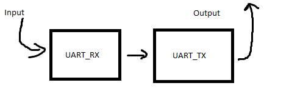
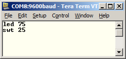
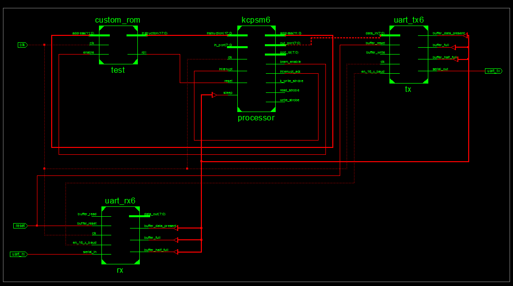
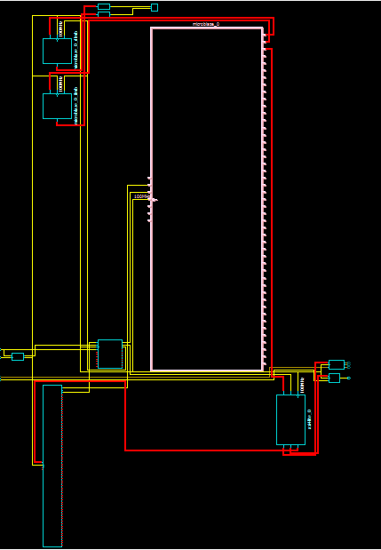

# Lab 3 #
## Table of Contents ##
- [Introduction](#introduction)
- [Approach](#approach)
- [Implementation](#implementation)
    - [Top Shell Diagram](#top-shell-diagram)
    - [PicoBlaze](#picoblaze)
    - [MicroBlaze](#microbloaze)
- [Testing and Debugging](#testing-and-debugging)
    - [UCF file](#ucf)
    - [PAO file](#pao)
- [Conclusion](#conclusion)
- [Documentation](#documentation)


## Introduction ##
The purpose of this lab was to use the picoblaze process in VHDL to instatiate a USB-to-UART bridge.  I created a program to take input over my computers serial port and read/write to any one of my input or output peripherals: LED's or switches.  In the second part, the same logic was implemented, but using the MicroBlaze processor instead:

 1. Get characters to echo the terminal using the PicoBlaze
 2. Get the PicoBlaze program to correctly process LED and SWT commands 
 3. Get characters to echo the terminal using the MicroBlaze
 4. Get the MicroBlaze program to correctly process LED and SWT commands 
z
## Approach ##
The most important part to the lab was to get the characters to echo correctly to the screen.  This demonstrates that the processor had been instantiated correctly and only the code needed to be significantly modified from that point on.

 - The basic approach to getting the echo:

graphic 1
 - Implement the LED command
 - Implement the SWT command



graphic 2

## Implementation ##
There were four components to get the basic functionality working.  The RX and TX module needed to be included in order to echo the character correctly on the screen.  After, the PicoBlaze needed to be included, along with the ROM containing our code to run the program.  The following lab4a top shell can be seen below.
### Top Shell Diagram ###

graphic 4
### PicoBlaze ###
The PicoBlaze module was relatively easy to implement.  The hardest part of this part of the project was correctly getting the UART TX and RX modules working.  After first being told that the terminal should show double characters, this lead to the correct code as being seen incorrect.  However, all that was needed was the RX modules to be directly wired to the TX module in the vhdl.  An example of the implementation of th modules is seen below:
```vhdl
	tx: uart_tx6
		port map ( 
			data_in => uart_tx_data_in,
			en_16_x_baud => en_16_x_baud,  
			serial_out => uart_tx,			
			buffer_write => write_to_uart_tx,
			buffer_data_present => uart_tx_data_present,
			buffer_half_full => uart_tx_half_full,
			...
```
The documentation that came with the source code for the PicoBlaze provided multiple examples of how to use multiplexors to hook up the module to the custom VHDL peripherals.  An example of some of the code can be seen below:
```vhdl
 if rising_edge(clk) then
    case port_id(1 downto 0) is
        -- Read UART status at port address 00 hex
        when "00" =>  in_port(0) <= uart_tx_data_present;
                      in_port(1) <= uart_tx_half_full;
                      in_port(2) <= uart_tx_full; 
                      in_port(3) <= uart_rx_data_present;
                      ...
    if (read_strobe = '1') and (port_id(1 downto 0) = "01") then
        read_from_uart_rx <= '1';
    else
```
The assembly for the PicoBlaze was relatively simple, just outputting character to the custom IO ports for the PicoBlaze module.  An example of the IO for the PicoBlaze is shown in the following code:
```
 wait_for_letter:
 	in status, status_port
 	test s3, rx_present      ; If data is present, carry bit should be 1
 	jump z, wait_for_letter  ;Z bit will be set if there the rx_present bit is not set
 	ret
```
### MircroBlaze ###
The MicroBlaze required much less vhdl code to setup than the PicoBlaze, but took much longer to figure out the toolchain.  The processor is much large than the PicoBlaze, as demonstrated in the following deseign:

The code for the project was able to be written in C.  This allowed for a much faster development cycle than the assembly for the PicoBlaze.  Some of the code to receive a character is shown:
```vhdl
void getChar(unsigned char *inputPtr){
	*inputPtr = XUartLite_RecvByte(0x84000000);
	XUartLite_SendByte(0x84000000, (unsigned char) *(inputPtr));
}
```
## Testing and Debugging ###
Several issues arose during the implementation of primarily the MicroBlaze module.
### UCF ###
During the implementation of the switches for the MicroBlaze, the correct constraints were not added to the UCF file.  Unliked the other files that the switches needed to be added to, the missing UCF constraints did not throw any errors.  This led to junk values being placed in the memory segments needing to be read.  Discovered after going through different files in frustration.
### PAO ###
The PAO file tells the bitstream generator where different .vhd files should be for the project.  After attempting to generate the bitstream, the project manager kept saying that necessary vhd files were missing.  After mentioning to C2C Parks the problem, he commented that the file names and locations needed to be in the driver .pao file.  There was much rejoicing.
## Conclusion ##
The amount of time needed to implement required funcitonality was less than most labs, however there were some hiccups.  Too much time was spent on problems with the toolset, like understanding custom VHDL needed to be added to the pao file for the microblaze.  This cause extreme amounts of time to be spent on problems that weren't even really part of the lab.
## Documentation ##
C2C Parks pointed out that the missing vhdl file smeanted the .pao file needed to be edited